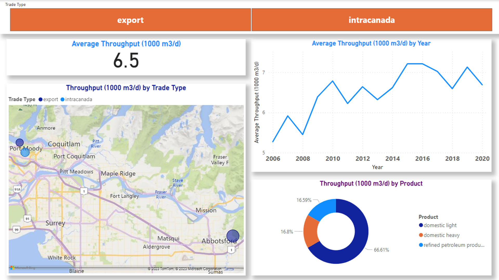

# Trans Mountain Pipeline Project




### Introduction
The Trans Mountain Pipeline Project is a comprehensive data analysis study conducted by Falcon Analysts. The project's scope revolves around understanding and resolving the complexities surrounding the pipeline expansion, including legal, political, social, and environmental challenges. This analysis provides key insights to assist decision-makers in balancing the commercial merits of the pipeline with the concerns of First Nations, Indigenous peoples, and environmental groups.

### Table of Contents
1. [Business Understanding](#business-understanding)
2. [Data Understanding](#data-understanding)
3. [Data Preparation](#data-preparation)
4. [Modeling](#modeling)
5. [Evaluation](#evaluation)
6. [Conclusion](#conclusion)

---

## Business Understanding
- **Perspective**: The project aims to analyze the Trans Mountain Pipeline expansion to provide actionable insights for decision-makers.
- **Key Business Questions**:
  - Which key point exhibits the best utilization rate over the years?
  - When will the pipeline reach a utilization level of 45%?
  - What is the probability that the pipeline's throughput will exceed 8,000m³/day?

---

## Data Understanding
- **Dataset**: The analysis uses the `trans-mountain-throughput-and-capacity-dataset.csv`, containing:
  - **Original Dataset**: 14 columns and 1,218 rows.
  - **Refined Dataset**: 9 columns and 1,218 rows (after data cleansing).
- **Data Characteristics**:
  - Key dimensions include Year, Pipeline Name, Key Point, Latitude, Longitude, Trade Type, and Product.
  - Facts include Throughput and Available Capacity.

---

## Data Preparation
- Data was cleaned and transformed using Microsoft Excel.
- Data was imported into SQL Server Management Studio (SSMS) as a transactional database (OLTP) and later modeled as a Data Warehouse (OLAP).
- Key Steps:
  - **Dimension Creation**: Extracted dimensions such as Year, Key Point, and Product.
  - **Fact Table Creation**: Derived throughput and capacity metrics.
  - **ETL Process**: Utilized SSIS for dimension and fact transformations.

---

## Modeling
- Data was modelled into a structured format for analysis.
- Relationships between dimensions and facts were established in a database diagram.

---

## Evaluation
- **Key Insights**:
  - Suma's key point exhibited the best utilization rate (25.3%) compared to others.
  - Target utilization of 45% is predicted to be reached in 2043, with an upper-bound possibility of 2035 (95% confidence).
  The probability of throughput exceeding 8,000m³/day is approximately 42% (using Monte Carlo Simulation).
- Decision-makers can use these insights to evaluate future actions and investments.

---

## Conclusion
This project provides valuable insights into the utilization and throughput of the Trans Mountain Pipeline, enabling informed decisions that balance commercial, environmental, and social considerations.

---

### Tools and Technologies
- **Data Preparation**: Microsoft Excel, SQL Server Management Studio (SSMS), SQL Server Integration Services (SSIS)
- **Analysis**: Monte Carlo Simulation
- **Documentation**: Microsoft Word

---

### Project Files
- **Documentation**:
  - `THE ALBERTA TO BRITISH COLUMBIA.docx`: Detailed project documentation.
- **Data**:
  - `trans-mountain-throughput-and-capacity-dataset.csv`: The original dataset was used for analysis.
- **Analysis**:
  - Processed Excel files and SSMS database files.

---

### How to Use
1. Clone the repository to your local machine:
   ```bash
   git clone https://github.com/your-username/Trans-Mountain-Project.git
